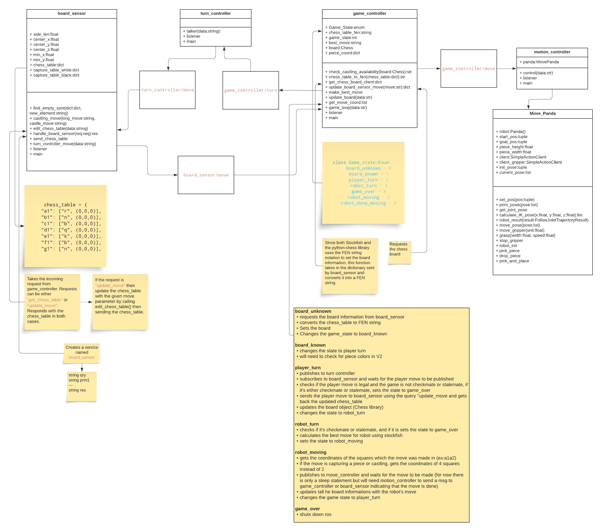

# ChessMate

# Control with Moveit in Gazebo
> These commands may be vary depend on your system!
`roslaunch panda_moveit_config demo_gazebo.launch`

# Realtime Control with Moveit 

cd ~/franka_ros2
source devel/setup.bash
roslaunch franka_control franka_control.launch robot_ip:=10.0.0.2

cd ~/panda_chessmate/FrankaRos
source devel/setup.bash
roslaunch panda_movit_config move_group.launch arm_id:=panda load_gripper:=true

rviz
Add > moveit_ros_visualization > MotionPlanning

# Launch gazebo with example controller

roslaunch franka_gazebo panda.launch x:=0 y:=0 z:=0 world:=$(rospack find franka_gazebo)/world/stone.sdf controller:=effort_joint_trajectory_controller

# Current errors and TODO
- It automatically assumes that the player is playing the white pieces and robot is playing the black pieces. (will be fixed in the next version)
- It doesn't send robot's first move to motion_controller. Sends rest of the moves correctly.
- I get 2 prompts when I first start turn_controller for the first player move, then it goes back to normal. Doesn't affect the game just need to enter the first move twice
- Gets stuck after checkmate. The is_checkmate() condition doesn't work.
- motion_controller for gazebo: pick and place working but robot makes unnecessary movements.
- Capturing and recovering pieces not fully implemented yet!
- Sending 2 moves for the robot for castling and capturing pieces not implemented yet
- motion_controller for the real robot hasn't been tested yet
- motion_controller needs to send a message to board_sensor indicating that the move is done (V1)

# V2 TODO
- SETTING UP THE BOARD AND SENDING IT TO GAME CONTROLLER
  - Need to detect the board square length
  - Need to detect the center coordinates of the board
  - Need to detect the pieces (and it's width and height)
  - Need to detect in which square each of the pieces are --> we can infer the  square coordinates after finding out the square len and center
  - Need to detect who is playing with white and who is playing with black

- DURING THE GAME
  - Need to find a way to detect the player move and send it to game controller in the format a1a2
  - Need to find a way to signal that the player move is over and change turns accordingly
  - tracking

# franka_gazebo

Replace the original franka_gazebo with the one provided here. (Added models for chessboard, pieces etc)

# Needed packages
- libfranka
- franka_ros
- stockfish
- python-chess
- roboticstoolbox-python

# UML

